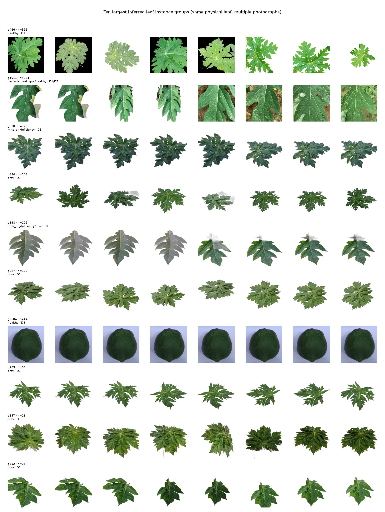
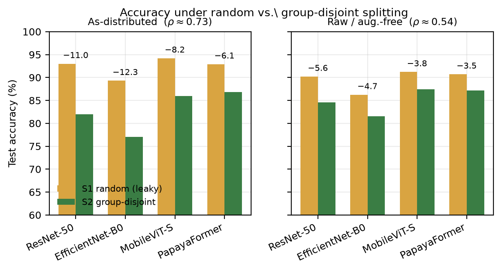
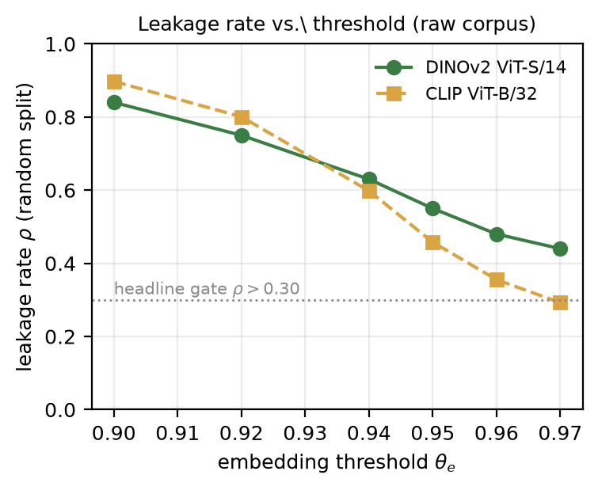
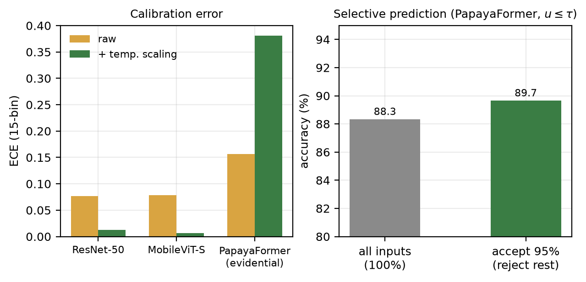

<div align="center">



# 🍈 CLEAR‑Papaya

### A leakage‑audited, calibration‑aware benchmark for papaya leaf‑disease recognition

*Published papaya‑leaf accuracies of **96–99.9 %** are measured under a protocol that lets*
*photographs of the **same physical leaf** land on both sides of the train/test split.*
*Fix the protocol and the honest ceiling is the **high 80s** — not 99 %.*

<br>


-1f6f3b?style=for-the-badge)


</div>

---

## ✴️ The headline

> On three public papaya‑leaf corpora (**6 864 images**), a standard random split leaks near‑duplicate
> images of the same leaf across train and test at rate **ρ = 0.55** on the raw imagery
> (**ρ = 0.73** once undeclared augmentation copies inside one source are counted).
> Correcting the split with a **leaf‑instance–disjoint protocol** removes **+8 – 12 accuracy points**
> from the as‑distributed numbers and **+4 – 6** even after augmentation is stripped.
> The effect holds across **two CNNs and a hybrid transformer**, and is reproduced by two
> training‑free probes — it is a property of *the split*, not of the model.

<div align="center">

| Split | ResNet‑50 | EfficientNet‑B0 | MobileViT‑S | **PapayaFormer** |
|:--|:--:|:--:|:--:|:--:|
| **S1** — random (leaky) | 93.0 % | 89.3 % | 94.2 % | 92.9 % |
| **S2** — group‑disjoint (ρ = 0) | 82.0 % | 77.0 % | 86.0 % | 86.8 % |
| **inflation** | **+11.0** | **+12.3** | **+8.2** | **+6.1** |

<sub>as‑distributed corpus · full numbers, 3 seeds × 5 folds, in [`results/`](results/)</sub>

</div>

<div align="center">

</div>

---

## 🧭 What is in this repository

```
CLEAR-Papaya/
├── manuscript/          full LaTeX paper + prototype PDF
├── src/                 01–17 · the audit + training pipeline (numbered, run in order)
├── kaggle/              10 self-contained GPU kernels (baselines, PapayaFormer, ablation,
│                        significance, corruption/open-set/low-data, calibration, XAI …)
├── results/            every JSON + Markdown result table produced (the numbers)
│   └── splits/         frozen group-disjoint split manifests (image → fold → group)
├── figures/            all 8 paper figures (PDF/PNG) + the generator
├── docs/               phase-1 handoff, licence verification, execution roadmap
├── make_figures.py     regenerates every figure from results/
├── export_onnx.py      PapayaFormer → ONNX for on-device benchmarking
├── bench.py            latency benchmark (Android via Termux / Raspberry Pi)
└── requirements.txt
```

---

## 📊 Results at a glance

<table>
<tr><th align="left">Question</th><th align="left">Finding</th><th>Where</th></tr>

<tr><td><b>Leakage rate ρ</b></td>
<td><b>0.55</b> (DINOv2) · <b>0.46</b> (CLIP) at θ<sub>e</sub>=0.95; ≥ 0.44 at every threshold tested</td>
<td><code>leakage_report.json</code><br><code>audit_clean_summary.md</code></td></tr>

<tr><td><b>Dataset integrity</b></td>
<td><b>29.4 %</b> of one source is undeclared augmentation duplicates · 175 leaf groups carry
<i>conflicting</i> disease labels across corpora</td>
<td><code>audit_clean_summary.md</code></td></tr>

<tr><td><b>Split inflation</b></td>
<td>+8–12 pp (as‑distributed) · +4–6 pp (raw) · consistent across ResNet‑50 / EfficientNet‑B0 / MobileViT‑S</td>
<td><code>sig_results.md</code></td></tr>

<tr><td><b>PapayaFormer</b><br>MSLA + evidential head</td>
<td>S2 <b>87.2 ± 4.7 %</b> — significantly &gt; ResNet‑50 &amp; EfficientNet‑B0 (p<sub>Holm</sub>&lt;10⁻³),
tied with MobileViT‑S; lowest Brier; 16.8 M params</td>
<td><code>sig_results.md</code><br><code>ablation.md</code></td></tr>

<tr><td><b>Selective prediction</b></td>
<td>abstain on the ~5 % most‑uncertain inputs (u &gt; τ) → accuracy <b>88.3 % → 89.7 %</b>, single forward pass</td>
<td><code>pf_results.md</code></td></tr>

<tr><td><b>Clever‑Hans probe</b></td>
<td>background <i>alone</i> predicts the disease at <b>~64 %</b> (chance 16.7 %) — Δ<sub>bg</sub> ≈ +48 pp</td>
<td><code>rq3_results.md</code></td></tr>

<tr><td><b>Cross‑source (S3)</b></td>
<td>train D1∪D2 → test D3: <b>87 % → ~25 %</b>, near chance — the clean S2 number is still an <i>upper</i> bound</td>
<td><code>extra1.md</code></td></tr>

<tr><td><b>Corruption</b></td>
<td>−22 to −34 pp under noise/blur/JPEG; PapayaFormer is the <i>least</i> robust (reported, not hidden)</td>
<td><code>rq456.md</code></td></tr>

<tr><td><b>Latency</b></td>
<td>PapayaFormer FP32: <b>12 ms</b> GPU · <b>64 ms</b> single‑thread CPU (ONNX Runtime)</td>
<td><code>rq456.md</code></td></tr>

</table>

<div align="center">


</div>

---

## ⚡ Quickstart

```bash
git clone https://github.com/DevMursLab/research-lab.git
cd research-lab/CLEAR-Papaya
pip install -r requirements.txt

# 1 · put the three source datasets under data/D1 data/D2 data/D3   (see data/README.md)
# 2 · run the audit pipeline
python src/03_build_manifest.py
python src/05_hashes.py
python src/06_embeddings.py --model dinov2_vits14      # GPU / Colab
python src/07_similarity_graph.py --theta_e 0.95
python src/09_leakage_rate.py                          # ← prints ρ, the headline
python src/11_group_kfold_split.py                     # freezes the group-disjoint split

# 3 · reproduce a figure without retraining
python make_figures.py
```

Every heavy experiment is a **drop‑in Kaggle kernel** under [`kaggle/`](kaggle/) — push it, attach the
image bundle, run. Each writes an incremental JSON so a timeout never loses work.

---

## 🔬 Method in one paragraph

Every image is embedded with a frozen self‑supervised encoder (DINOv2 ViT‑S/14; CLIP ViT‑B/32 as a
robustness check). Exact‑hash, perceptual‑hash, and **mutual‑kNN cosine** links are unioned with
union‑find into **leaf‑instance groups**; the leakage rate **ρ** is the fraction of a random split's
test set whose group also appears in train. Splitting is then done **on groups**, so no physical leaf
is ever on both sides. **PapayaFormer** adds a Multi‑Scale Lesion‑Attention module (three dilated
branches → a spatial evidence map, γ initialised at 0 so it inserts into a pretrained backbone
cleanly) and an **evidential Dirichlet head** that yields class probabilities *and* a single‑pass
uncertainty `u` for threshold‑based abstention.

---

## 📁 Data

| ID | Dataset | DOI | Role |
|:--|:--|:--|:--|
| D1 | Papaya Leaf Disease Image Dataset (Mendeley) | `10.17632/3kwgxg4stb.1` | primary — raw images only |
| D2 | BDPapayaLeaf (Mendeley) | `10.17632/p997fvf526.1` | primary |
| D3 | Papaya Diseases Dataset, Sethy (Mendeley) | `10.17632/yvcwypp8rz.1` | cross‑source + open‑set |

All CC BY 4.0. Placement instructions in [`data/README.md`](data/README.md).

---

## 📝 Citation

```bibtex
@article{clearpapaya2026,
  title   = {CLEAR-Papaya: A Leakage-Audited, Calibration-Aware and Edge-Deployable
             Framework for Papaya Leaf Disease Recognition under Field-Realistic
             Distribution Shift},
  author  = {Hawlader, Mursalin},
  year    = {2026},
  note    = {Manuscript}
}
```

---

<div align="center">

**Mursalin Hawlader** · Department of Computer Science &amp; Engineering, Netrokona University
<br><sub>Part of the <a href="https://github.com/DevMursLab/research-lab">DevMursLab · research‑lab</a> collection</sub>

</div>
